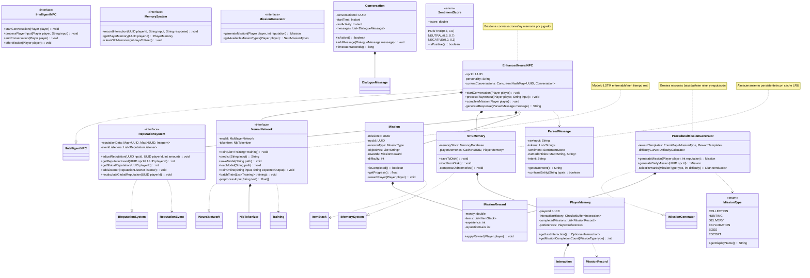

# 📜 IntelligentNPCs

> [!CAUTION]
> Este Proyecto esta en una fase Muy Beta


> [!NOTE]
> Próximamente actulizacion del Proyecto y mucho más.


Plugin de NPCs inteligentes con redes neuronales, sistema de misiones procedurales y diálogos dinámicos.

## 📌 Características Principales

- 🧠 NPCs con comportamiento basado en redes neuronales
- 📜 Sistema de misiones procedurales generadas dinámicamente
- 💬 Diálogos naturales con procesamiento de lenguaje (NLP)
- 🏆 Sistema de reputación y memoria de interacciones
- 💰 Integración con economía (Vault)
- 🛠️ Altamente configurable

## 📦 Instalación

1. Descarga el archivo `.jar` desde [Releases](#)
2. Colócalo en la carpeta `plugins/` de tu servidor
3. Reinicia el servidor
4. Configura según tus necesidades en `plugins/IntelligentNPCs/config.yml`

## 🧩 Dependencias

| Plugin | Obligatorio | Descripción |
|--------|-------------|-------------|
| Citizens | ✅ | Para el sistema de NPCs |
| Vault | ❌ (Opcional) | Para economía |
| PlaceholderAPI | ❌ | Para integración con otros plugins |

## 🛠 Uso Básico

```bash
      /intelligentnpc create <nombre> <personalidad> - Crea un nuevo NPC
      /intelligentnpc delete - Elimina el NPC seleccionado
      /intelligentnpc talk - Habla con el NPC seleccionado
      /intelligentnpc list - Lista todos los NPCs
      /intelligentnpc delete - Borra el NPC que estas mirando
      /intelligentnpc reload - Recarga la configuración
```

## 📐 Diagrama de Clases


```mermaid
classDiagram
    %% -------------------------------
    %% Interfaces Principales
    %% -------------------------------
    class IntelligentNPC {
        <<interface>>
        +startConversation(Player player): void
        +processPlayerInput(Player player, String input): void
        +endConversation(Player player): void
        +offerMission(Player player): void
    }

    class MemorySystem {
        <<interface>>
        +recordInteraction(UUID playerId, String input, String response): void
        +getPlayerMemory(UUID playerId): PlayerMemory
        +cleanOldMemories(int daysToKeep): void
    }

    class MissionGenerator {
        <<interface>>
        +generateMission(Player player, int reputation): Mission
        +getAvailableMissionTypes(Player player): Set~MissionType~
    }

    class ReputationSystem {
        <<interface>>
        +adjustReputation(UUID npcId, UUID playerId, int amount): void
        +getReputationLevel(UUID npcId, UUID playerId): int
        +getGlobalReputation(UUID playerId): int
    }

    class NeuralNetwork {
        <<interface>>
        +train(List~Training~ training): void
        +predict(String input): String
        +saveModel(String path): void
        +loadModel(String path): void
    }

    %% -------------------------------
    %% Implementaciones Principales
    %% -------------------------------
    class EnhancedNeuralNPC {
        -npcId: UUID
        -personality: String
        -currentConversations: ConcurrentHashMap~UUID, Conversation~
        +startConversation(Player player): void
        +processPlayerInput(Player player, String input): void
        +completeMission(Player player): void
        -generateResponse(ParsedMessage message): String
    }

    class NeuralNetwork {
        -model: MultilayerNetwork
        -tokenizer: NlpTokenizer
        +trainOnline(String input, String expectedOutput): void
        +batchTrain(List~Training~ training): void
        -preprocessInput(String text): float[]
    }

    class ProceduralMissionGenerator {
        -rewardTemplates: EnumMap~MissionType, RewardTemplate~
        -difficultyCurve: DifficultyCalculator
        +generateMission(Player player, int reputation): Mission
        +generateDailyMission(UUID npcId): Mission
        -selectRewards(MissionType type, int difficulty): List~ItemStack~
    }

    class NPCMemory {
        -memoryStore: MemoryDatabase
        -playerMemories: Cache~UUID, PlayerMemory~
        +saveToDisk(): void
        +loadFromDisk(): void
        -compressOldMemories(): void
    }

    class ReputationSystem {
        -reputationData: Map~UUID, Map~UUID, Integer~~
        -eventListeners: List~ReputationListener~
        +addListener(ReputationListener listener): void
        +recalculateGlobalReputation(UUID playerId): void
    }

    %% -------------------------------
    %% Modelos de Datos
    %% -------------------------------
    class Mission {
        -missionId: UUID
        -npcId: UUID
        -missionType: MissionType
        -objectives: List~String~
        -rewards: MissionReward
        -difficulty: int
        +isCompleted(): boolean
        +getProgress(): float
        +awardPlayer(Player player): void
    }

    class PlayerMemory {
        -playerId: UUID
        -interactionHistory: CircularBuffer~Interaction~
        -completedMissions: List~MissionRecord~
        -preferences: PlayerPreferences
        +getLastInteraction(): Optional~Interaction~
        +getMissionCompletionCount(MissionType type): int
    }

    class Conversation {
        -conversationId: UUID
        -startTime: Instant
        -lastActivity: Instant
        -messages: List~DialogueMessage~
        +isActive(): boolean
        +addMessage(DialogueMessage message): void
        +timeoutInSeconds(): long
    }

    class ParsedMessage {
        -rawInput: String
        -tokens: List~String~
        -sentiment: SentimentScore
        -namedEntities: Map~String, String~
        -intent: String
        +getMainIntent(): String
        +containsEntity(String type): boolean
    }

    class MissionReward {
        -money: double
        -items: List~ItemStack~
        -experience: int
        -reputationGain: int
        +applyReward(Player player): void
    }

    %% -------------------------------
    %% Enums y Tipos de Datos
    %% -------------------------------
    class MissionType {
        <<enum>>
        COLLECTION
        HUNTING
        DELIVERY
        EXPLORATION
        BOSS
        ESCORT
        +getDisplayName(): String
    }

    class SentimentScore {
        <<enum>>
        POSITIVE(0.7, 1.0)
        NEUTRAL(0.3, 0.7)
        NEGATIVE(0.0, 0.3)
        +score: double
        +isPositive(): boolean
    }

    %% -------------------------------
    %% Relaciones de Implementación
    %% -------------------------------
    EnhancedNeuralNPC ..|> IIntelligentNPC
    NeuralNetwork ..|> INeuralNetwork
    ProceduralMissionGenerator ..|> IMissionGenerator
    NPCMemory ..|> IMemorySystem
    ReputationSystem ..|> IReputationSystem

    %% -------------------------------
    %% Relaciones de Composición
    %% -------------------------------
    EnhancedNeuralNPC *-- NeuralNetwork
    EnhancedNeuralNPC *-- NPCMemory
    EnhancedNeuralNPC *-- ReputationSystem
    EnhancedNeuralNPC o-- Mission
    NPCMemory *-- PlayerMemory
    PlayerMemory *-- Interaction
    ProceduralMissionGenerator *-- MissionReward
    Mission *-- MissionReward
    Conversation *-- DialogueMessage
    NeuralNetwork *-- NlpTokenizer

    %% -------------------------------
    %% Relaciones de Dependencia
    %% -------------------------------
    EnhancedNeuralNPC ..> ParsedMessage
    ProceduralMissionGenerator ..> MissionType
    NeuralNetwork ..> Training
    ReputationSystem ..> ReputationEvent
    Mission ..> ItemStack
    PlayerMemory ..> MissionRecord

    %% -------------------------------
    %% Notas Adicionales
    %% -------------------------------
    note for EnhancedNeuralNPC "Gestiona conversaciones\ny memoria por jugador"
    note for NeuralNetwork "Modelo LSTM entrenable\nen tiempo real"
    note for ProceduralMissionGenerator "Genera misiones basadas\nen nivel y reputación"
    note for NPCMemory "Almacenamiento persistente\ncon cache LRU"
```

## 🔧 Configuración

Edita `config.yml` para personalizar:

```yaml
# Configuración de IntelligentNPCs
settings:
  # Configuración general del plugin
  debug-mode: false
  save-interval: 300  # Segundos entre guardados automáticos
  max-conversation-length: 15  # Máximo de mensajes por conversación
  default-personality: "neutral"  # Personalidad por defecto para nuevos NPCs

# Configuración de NPCs
npcs:
  # Personalidades disponibles
  personalities:
    warrior:
      display-name: "Guerrero"
      response-speed: 1.2  # Multiplicador de velocidad de respuesta
      aggression-level: 0.7  # 0-1
      mission-chance: 0.6  # Probabilidad de ofrecer misiones
    scholar:
      display-name: "Erudito"
      response-speed: 0.8
      aggression-level: 0.1
      mission-chance: 0.4
    merchant:
      display-name: "Mercader"
      response-speed: 1.0
      aggression-level: 0.3
      mission-chance: 0.8
    neutral:
      display-name: "Neutral"
      response-speed: 1.0
      aggression-level: 0.5
      mission-chance: 0.5

  # Configuración de spawn
  spawn:
    max-npcs-per-chunk: 2
    spawn-chance: 0.15  # Probabilidad de spawn en chunks válidos

# Configuración de misiones
missions:
  difficulty-settings:
    min-level: 1
    max-level: 10
    level-multiplier: 0.5  # Multiplicador de dificultad basado en nivel
  
  reward-settings:
    base-money-reward: 5.0
    money-multiplier: 1.5
    item-reward-chance: 0.65
    xp-reward-base: 10

  cooldowns:
    between-missions: 1200  # 20 minutos en segundos
    same-player-mission: 3600  # 1 hora en segundos

# Configuración de diálogos
dialogue:
  greeting-variations: 5  # Número de saludos diferentes por personalidad
  response-timeout: 30  # Segundos antes de terminar conversación inactiva
  memory-size: 10  # Número de interacciones recordadas por jugador

  # Palabras clave para triggers especiales
  triggers:
    mission-request: ["misión", "tarea", "trabajo", "quest"]
    help-request: ["ayuda", "socorro", "problema"]
    trade-request: ["comprar", "vender", "intercambio"]

# Configuración de reputación
reputation:
  base-gain: 1
  base-loss: 2
  mission-complete-gain: 5
  mission-fail-loss: 3
  levels:
    -100: "Enemigo"
    -50: "Desconfiado"
    0: "Neutral"
    50: "Aliado"
    100: "Héroe"

# Configuración de economía (requiere Vault)
economy:
  enabled: true
  currency-symbol: "$"
  reward-multiplier: 1.0
  penalty-multiplier: 0.5

# Configuración de integraciones
integrations:
  Citizens: true
  Vault: true
  PlaceholderAPI: false
  WorldGuard: true

# Mensajes personalizables
messages:
  greetings:
    - "¡Saludos, {player}!"
    - "¿En qué puedo ayudarte hoy?"
    - "Hola, ¿qué tal?"
  mission-offer:
    - "Tengo una misión para ti: {mission_objective}"
    - "¿Podrías ayudarme con {mission_objective}?"
    - "Necesito a alguien para {mission_objective}, ¿te interesa?"
  reputation-change:
    positive: "¡Tu reputación con {npc_name} ha mejorado!"
    negative: "Tu reputación con {npc_name} ha empeorado..."
  errors:
    no-mission: "No tengo ninguna misión para ti ahora mismo."
    cooldown: "Vuelve más tarde, no tengo nada para ti todavía."
    no-permission: "No pareces estar preparado para esto."

# Configuración avanzada
advanced:
  nlp:
    enabled: true
    cache-size: 1000
    timeout: 5000  # ms
  performance:
    async-processing: true
    max-threads: 4
  logging:
    conversation-logs: false
    save-format: "json"

```

## 📄 Licencia

Este proyecto está bajo la licencia MIT. Ver [LICENSE](LICENSE) para más detalles.

## 🤝 Contribuir

1. Haz fork del proyecto
5. Abre un Pull Request

